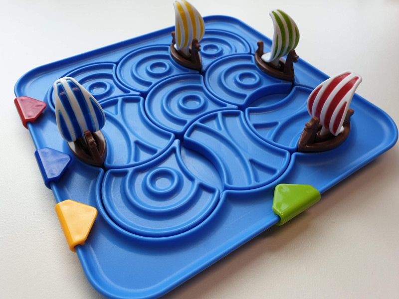
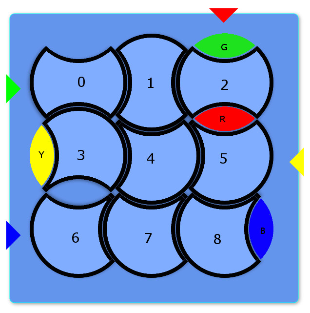
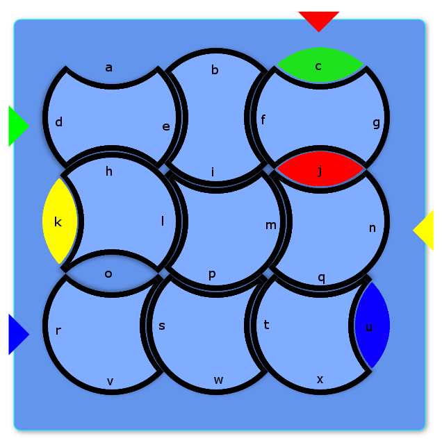

# COMP1110 Assignment 1

## Academic Honesty and Integrity

Honesty and integrity are of utmost importance. These goals are *not* at odds
with being resourceful and working collaboratively. You *should* be resourceful
and you should discuss the assignment
and other aspects of the course with others taking the class. However, *you must
never misrepresent the work of others as your own*. If you have taken ideas from
elsewhere or used code sourced from elsewhere, you must say so with *utmost
clarity*. At each stage of the assignment you will be asked to submit a statement
of originality, either as a group or as individuals. This statement is the place
for you to declare which ideas or code contained in your submission were sourced
from elsewhere.

Please read the ANU's [official position](http://academichonesty.anu.edu.au/) on
academic honesty. If you have any questions, please ask me.

Carefully review the [statement of originality](originality.yml) which you must
complete.  Edit that statement and update it as you complete the assignment,
ensuring that when you complete the assignment, a truthful statement is committed
and pushed to your repo.

## Purpose

In this assignment is introductory, helping you gain familiarity with the basics
of Java, but doing so in the context of slightly larger piece of code.  Most
of the assignment is composed of a series of small tasks.

## Assignment Deliverable

The assignment is worth 5% of your total assessment, and it will be marked out
of 5. However, these marks are [redeemable](https://cs.anu.edu.au/courses/comp1110/assessments/redeemable/) by the exam, so if your exam mark / 20
is higher than your assignment one mark, you will get the exam mark / 20 rather
than the assignment one mark. **The mark breakdown is described on the
[deliverables](https://cs.anu.edu.au/courses/comp1110/assessments/deliverables/#D1A) page.**

The assignment is due at **[10:45am Friday Week 3 AEDT](https://www.timeanddate.com/worldclock/fixedtime.html?msg=Assignment+1+Due&iso=20200312T2345&p1=%253A), 13 March 2020** ([time remaining](https://www.timeanddate.com/countdown/generic?p0=1440&iso=20200312T2345&msg=Assignment%201%20Due)).
You can find [this deadline](https://cs.anu.edu.au/courses/comp1110/assessments/deliverables/#D1A)
on the [deliverables page](https://cs.anu.edu.au/courses/comp1110/assessments/deliverables/), where all assignment deadlines for this semester are
listed.
Your tutor will mark your assignment by accessing your GitLab repository, so it is essential that you carefully follow
instructions for setting up and maintaining your repository. You will be marked
according to **whatever is committed to your repository at the time of the deadline**.
Since the first assignment is redeemable, **[late extensions
are not offered and will not be given](https://cs.anu.edu.au/courses/comp1110/deadlines/)**. As always, throughout the course, if
some significant circumstance arises outside of the course that affects your capacity to complete the course, please carefully follow the ANU's [special consideration process](http://www.anu.edu.au/students/program-administration/assessments-exams/special-assessment-consideration), and your circumstances will be accounted for in your final assessment.

## Overview

The assignment is based on a simple children's puzzle called
[Vikings - Brainstorm
](https://www.smartgamesusa.com/vikings?___store=en),
made by [SmartGames](https://www.smartgamesusa.com/), a producer of
educational games.  The design of the game and all of the imagery in
this assignment comes from their Vikings game.

SmartGames have released a [video walkthrough of the the Vikings game](https://www.youtube.com/watch?v=rn6WDGC6lzo).

The game is played by rotating circular tiles representing the sea so as
to move coloured boats to their target placements at the edge of the
board.

## Tiles and Boats

The game comprises nine sea tiles and between one and four boats.
The sea tiles are numbered from the top-left of the board 0-8, and the
boats are labelled by the first letter of their colour, i.e.
* 'B' = blue
* 'G' = green
* 'R' = red
* 'Y' = yellow
The number of each tile and the labels of the boats are shown for an
example game below.

There are two types of tile: 'N' and 'O'. The shape of each type is cut from a full circle:
* An 'N' tile has two lenses removed from it that are next  
to each other and meet at the radius of the circle, like tiles 3-8 in
the image above. There are six 'N' tiles.
* An 'O' tile has two lenses removed on opposing sides of the circle,
like tiles 0-2 in the image above. There are three 'O' tiles.

Each tile can be placed in one of four orientations (0-3).
* For an 'N' tile, orientation 0 has the empty spaces (lenses) at the right and bottom of the tile.
* For an 'O' tile, orientation 0 has the empty spaces at the right and left of the tile.

For all tiles, orientation 1 is a single quarter-turn clockwise from orientation 0;
orientation 2 is a half-turn clockwise from orientation 0; and
orientation 3 is three quarter-turns clockwise from orientation 0.

## Edges

Each neighbouring pair of tiles shares an edge.
The edges are labelled 'a'-'x' from top to bottom and left to right.
The label of each edge is shown for an example game in the image below.

When a tile is rotated, all the boats on its edges move with it.
A tile can only be rotated if there is a boat on at least one of its
edges.
A tile is prevented from rotating if it would be blocked by another tile.
In the example game above, tile 6 is prevented from rotating by
tile 7, because there is no empty space at their shared edge 's'.
However, tile 3 can be rotated because there is a yellow boat at edge 'k'
and a free space at edge 'o' between tiles 3 and 6.
Rotating tile 3 from its current orientation (1) to orientation 2 would
cause the boat at edge 'k' to move to edge 'h', and the free space at edge
'o' to move to 'k'.

## Encoding Board State

The current state of the board at any time is encoded as a board string
of between 20 and 26 characters.
The start of the board string is nine groups of two characters each,
representing the type and orientation of each of the nine tiles in order
of their position.
The remainder of the board string is divided into 1-4 groups of two  
characters each, representing the position of each of the boats in order
'B'-'G'-'R'-'Y'.
The state of the example game in the pictures above would be represented  
by the board string "O1O0O1N1N2N2N3N3N3BuGcRjYk"

## Objective

The goal of the game is to rotate the tiles in sequence so as to
move each boat to its target placement on the edge of the board.
In the example game above, the target placement for each boat is marked  
with a coloured triangle of the same colour.

## Objective Encoding

An objective is specified in terms of two strings:
 - a board string representing the starting position and orientation of each tile and the  
starting position of the boats,
- a string of 2-8 characters representing the target placement for each boat. (An objective may include between one and four boats.)

For example, if the example game above were the starting position, the  
objective would be represented by the strings "O1O0O1N1N2N2N3N3N3BuGcRjYk",  
"BrGdRcYn".

### Your task

Unfortunately your version of the assignment has some missing code.
While the graphical user interface is complete, some of the important
logic is missing, so it won't work as described above.  It is your job
to fix the problems, each identified by a `FIXME` comment in the
source code, so that the code works.  Do not change the code except by
following each of the assigned tasks.  When those tasks are completed,
the game will function correctly.  Check your changes by using the
provided unit tests.

## Legal and Ethical Issues

First, as with any work you do, you must abide by the principles of
[honesty and integrity](https://cs.anu.edu.au/courses/comp1110/09-integrity/). I
expect you to demonstrate honesty and integrity in everything you do.

In addition to those ground rules, you are to follow the rules one
would normally be subject to in a commercial setting. In particular,
you may make use of the works of others under two fundamental
conditions: a) your use of their work must be clearly acknowledged,
and b) your use of their work must be legal (for example, consistent
with any copyright and licensing that applies to the given material).
**Please understand that violation of these rules is a very serious
offence.** However, as long as you abide by these rules, you are
explicitly invited to conduct research and make use of a variety of
sources. You are also given an explicit means with which to declare
your use of other sources (via originality statements you must
complete). It is important to realize that you will be assessed on the
basis of your original contributions to the project. While you won't
be penalized for correctly attributed use of others' ideas, the work
of others will not be considered as part of your
contribution. Therefore, these rules allow you to copy another
student's work entirely if: a) they gave you permission to do so, and
b) you acknowledged that you had done so. Notice, however, that if you
were to do this you would have no original contribution and so would
receive no marks for the assignment (but you would not have broken any
rules either).

## Evaluation Criteria

**The mark breakdown is described on the
[deliverables](https://cs.anu.edu.au/courses/comp1110/assessments/deliverables/#D1A) page.**

**Pass**
* Tasks #1, #2, #3, #4, and #5

**Credit**
* Tasks #6 and #7 *(in addition to all tasks required for Pass)*

**Distinction**
* Tasks #8, #9 and #10 *(in addition to all tasks required for Credit)*

**High Distinction**
* Task #11 *(in addition to all tasks required for Distinction)*

**IMPORTANT NOTE:** *It is very important that you understand that you are* **not**
*required to complete all elements of the
assignment. In fact, you are not encouraged to pursue the Distinction and High
Distinction tasks unless you feel motivated and able to do so. Recall that the
assignment is redeemable against the exam. The last parts of the assignment are
significantly harder than the others, but together worth only one additional mark. I
don't encourage you to spend too much time on this unless you are enjoying the
challenge of solving these harder problems.  Solutions to task #11
involve ideas that I have* **not covered**, *or not covered deeply in class; you may
need to go beyond the course material.*
